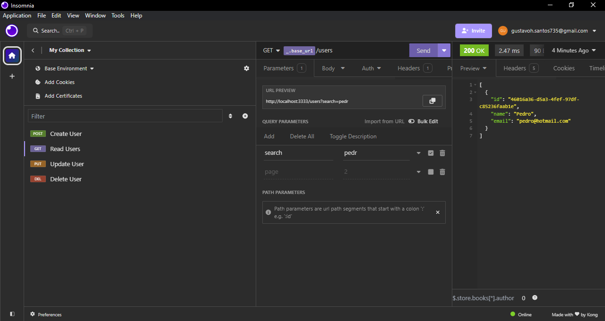

<h1 align="center">Simple REST API</h1>

    
    
    
    

     
    

 

# :page_with_curl: Description

Repository designed to study the fundamentals of Node.js and REST APIs. No external libraries were used, just Vanilla Js

# :game_die: Features
- [x] Create Users
- [x] Read Users
- [x] Update Users
- [x] Delete Users

# :hammer_and_wrench: Technologies
- [Node.js](https://nodejs.org/)

# :adult: Author
Made with 💜 Gustavo Henrique
